# AI-Mesh Component Inventory

**Version**: 1.0.0
**Date**: 2025-12-10
**Purpose**: Comprehensive inventory of all AI-Mesh components for plugin modularization

## Executive Summary

This document catalogs all components from the AI-Mesh monorepo (`/Users/ldangelo/Development/Fortium/ensemble/`) for reorganization into focused NPM plugins.

### Component Counts

| Component Type | Count | Total Size | Target Plugins |
|----------------|-------|------------|----------------|
| Agents | 28 | 336 KB | agent-mesh-core, agent-mesh-orchestrators, agent-mesh-specialists |
| Commands | 14 | ~200 KB | command-core, command-trd-workflow |
| Skills | 26 | ~500 KB | skills-frameworks, skills-infrastructure, skills-testing |
| Hooks | 10 | ~350 KB | hooks-metrics, hooks-lifecycle |
| **Total** | **78** | **~1.4 MB** | **10 plugins** |

---

## 1. Agents Inventory (28 agents)

### 1.1 Orchestrators (7 agents)

#### ensemble-orchestrator
- **Path**: `/Users/ldangelo/Development/Fortium/ensemble/agents/yaml/ensemble-orchestrator.yaml`
- **Size**: ~15 KB
- **Version**: 2.3.0
- **Tools**: Read, Task, Write, Edit, Bash, Grep, Glob, TodoWrite
- **Dependencies**:
  - Delegates to ALL 29 agents in mesh
  - Primary: tech-lead-orchestrator, product-management-orchestrator, qa-orchestrator, build-orchestrator, infrastructure-orchestrator, deployment-orchestrator
  - Specialists: backend-developer, frontend-developer, infrastructure-developer, code-reviewer, test-runner, playwright-tester, etc.
- **Target Plugin**: `@fortium/ensemble-agent-mesh-orchestrators`
- **Description**: Chief orchestrator for agent mesh coordination, task delegation, conflict resolution, TRD lifecycle management

#### tech-lead-orchestrator
- **Path**: `/Users/ldangelo/Development/Fortium/ensemble/agents/yaml/tech-lead-orchestrator.yaml`
- **Size**: ~12 KB
- **Version**: Latest
- **Tools**: Read, Write, Edit, Bash, Task
- **Dependencies**: backend-developer, frontend-developer, code-reviewer, test-runner
- **Target Plugin**: `@fortium/ensemble-agent-mesh-orchestrators`
- **Description**: Technical planning, architecture design, TDD methodology

#### product-management-orchestrator
- **Path**: `/Users/ldangelo/Development/Fortium/ensemble/agents/yaml/product-management-orchestrator.yaml`
- **Size**: ~10 KB
- **Tools**: Read, Write, Edit
- **Dependencies**: documentation-specialist, tech-lead-orchestrator
- **Target Plugin**: `@fortium/ensemble-agent-mesh-orchestrators`
- **Description**: Product lifecycle, PRD creation, stakeholder management

#### qa-orchestrator
- **Path**: `/Users/ldangelo/Development/Fortium/ensemble/agents/yaml/qa-orchestrator.yaml`
- **Size**: ~10 KB
- **Tools**: Read, Write, Bash
- **Dependencies**: test-runner, playwright-tester, code-reviewer
- **Target Plugin**: `@fortium/ensemble-agent-mesh-orchestrators`
- **Description**: Testing strategy, quality metrics, defect management

#### build-orchestrator
- **Path**: `/Users/ldangelo/Development/Fortium/ensemble/agents/yaml/build-orchestrator.yaml`
- **Size**: ~9 KB
- **Tools**: Read, Write, Bash
- **Dependencies**: git-workflow, test-runner
- **Target Plugin**: `@fortium/ensemble-agent-mesh-orchestrators`
- **Description**: CI/CD pipeline management, build optimization

#### infrastructure-orchestrator
- **Path**: `/Users/ldangelo/Development/Fortium/ensemble/agents/yaml/infrastructure-orchestrator.yaml`
- **Size**: ~10 KB
- **Tools**: Read, Write, Bash
- **Dependencies**: infrastructure-developer
- **Target Plugin**: `@fortium/ensemble-agent-mesh-orchestrators`
- **Description**: Environment provisioning, configuration management

#### deployment-orchestrator
- **Path**: `/Users/ldangelo/Development/Fortium/ensemble/agents/yaml/deployment-orchestrator.yaml`
- **Size**: ~9 KB
- **Tools**: Read, Write, Bash
- **Dependencies**: infrastructure-developer, code-reviewer
- **Target Plugin**: `@fortium/ensemble-agent-mesh-orchestrators`
- **Description**: Release management, deployment strategies, rollback procedures

### 1.2 Core Development Specialists (3 agents)

#### backend-developer
- **Path**: `/Users/ldangelo/Development/Fortium/ensemble/agents/yaml/backend-developer.yaml`
- **Size**: ~8 KB
- **Version**: 2.1.0
- **Tools**: Read, Write, Edit, Bash, Grep, Glob
- **Framework Skills**: NestJS, Phoenix, Rails, .NET (dynamically loaded from skills/)
- **Dependencies**:
  - Skills: `skills/nestjs-framework/`, `skills/phoenix-framework/`, `skills/rails-framework/`, `skills/dotnet-framework/`
  - Collaborates: frontend-developer, tech-lead-orchestrator, code-reviewer
- **Target Plugin**: `@fortium/ensemble-agent-mesh-specialists`
- **Description**: Server-side implementation with framework skill integration

#### frontend-developer
- **Path**: `/Users/ldangelo/Development/Fortium/ensemble/agents/yaml/frontend-developer.yaml`
- **Size**: ~10 KB
- **Version**: 2.1.0
- **Tools**: Read, Write, Edit, Grep, Glob, Bash, Task
- **Framework Skills**: React, Blazor (dynamically loaded from skills/)
- **Dependencies**:
  - Skills: `skills/react-framework/`, `skills/blazor-framework/`
  - Collaborates: backend-developer, code-reviewer
- **Target Plugin**: `@fortium/ensemble-agent-mesh-specialists`
- **Description**: UI development with accessibility (WCAG 2.1 AA) and performance optimization

#### infrastructure-developer
- **Path**: `/Users/ldangelo/Development/Fortium/ensemble/agents/yaml/infrastructure-developer.yaml`
- **Size**: ~28 KB
- **Version**: 2.2.0
- **Tools**: Read, Write, Edit, Grep, Glob, Bash, Task
- **Cloud Skills**: AWS, GCP, Azure, Helm, Kubernetes, Fly.io (dynamically loaded)
- **Dependencies**:
  - Skills: `skills/aws-cloud/`, `skills/helm/`, `skills/kubernetes/`, `skills/flyio/`
  - Detectors: `skills/cloud-provider-detector/`, `skills/tooling-detector/`
  - Collaborates: backend-developer, infrastructure-orchestrator
- **Target Plugin**: `@fortium/ensemble-agent-mesh-specialists`
- **Description**: Cloud-agnostic infrastructure with automatic provider detection

### 1.3 Quality & Testing Specialists (4 agents)

#### code-reviewer
- **Path**: `/Users/ldangelo/Development/Fortium/ensemble/agents/yaml/code-reviewer.yaml`
- **Size**: ~10 KB
- **Tools**: Read, Write, Edit, Bash
- **Dependencies**: None (terminal reviewer)
- **Target Plugin**: `@fortium/ensemble-agent-mesh-specialists`
- **Description**: Security scanning, DoD enforcement, quality gates

#### test-runner
- **Path**: `/Users/ldangelo/Development/Fortium/ensemble/agents/yaml/test-runner.yaml`
- **Size**: ~8 KB
- **Tools**: Read, Bash
- **Dependencies**: Skills for Jest, RSpec, pytest, ExUnit, xUnit
- **Target Plugin**: `@fortium/ensemble-agent-mesh-specialists`
- **Description**: Unit/integration test execution with intelligent triage

#### playwright-tester
- **Path**: `/Users/ldangelo/Development/Fortium/ensemble/agents/yaml/playwright-tester.yaml`
- **Size**: ~9 KB
- **Tools**: Read, Write, Bash (Playwright MCP)
- **Dependencies**: Playwright MCP server
- **Target Plugin**: `@fortium/ensemble-agent-mesh-specialists`
- **Description**: E2E testing with browser automation

#### test-reader-agent
- **Path**: `/Users/ldangelo/Development/Fortium/ensemble/agents/yaml/test-reader-agent.yaml`
- **Size**: ~6 KB
- **Tools**: Read, Grep, Glob
- **Dependencies**: None
- **Target Plugin**: `@fortium/ensemble-agent-mesh-specialists`
- **Description**: Test file analysis and reporting

### 1.4 Documentation Specialists (2 agents)

#### documentation-specialist
- **Path**: `/Users/ldangelo/Development/Fortium/ensemble/agents/yaml/documentation-specialist.yaml`
- **Size**: ~12 KB
- **Tools**: Read, Write, Edit
- **Dependencies**: None
- **Target Plugin**: `@fortium/ensemble-agent-mesh-specialists`
- **Description**: PRD/TRD/runbook creation, user guides

#### api-documentation-specialist
- **Path**: `/Users/ldangelo/Development/Fortium/ensemble/agents/yaml/api-documentation-specialist.yaml`
- **Size**: ~8 KB
- **Tools**: Read, Write, Edit
- **Dependencies**: backend-developer
- **Target Plugin**: `@fortium/ensemble-agent-mesh-specialists`
- **Description**: OpenAPI/Swagger documentation

### 1.5 Database Specialists (1 agent)

#### postgresql-specialist
- **Path**: `/Users/ldangelo/Development/Fortium/ensemble/agents/yaml/postgresql-specialist.yaml`
- **Size**: ~8 KB
- **Tools**: Read, Write, Bash
- **Dependencies**: None
- **Target Plugin**: `@fortium/ensemble-agent-mesh-specialists`
- **Description**: PostgreSQL optimization, schema design, query tuning

### 1.6 Workflow & Utility Specialists (6 agents)

#### git-workflow
- **Path**: `/Users/ldangelo/Development/Fortium/ensemble/agents/yaml/git-workflow.yaml`
- **Size**: ~8 KB
- **Tools**: Bash
- **Dependencies**: None
- **Target Plugin**: `@fortium/ensemble-agent-mesh-specialists`
- **Description**: Git operations with conventional commits

#### github-specialist
- **Path**: `/Users/ldangelo/Development/Fortium/ensemble/agents/yaml/github-specialist.yaml`
- **Size**: ~7 KB
- **Tools**: Bash
- **Dependencies**: git-workflow
- **Target Plugin**: `@fortium/ensemble-agent-mesh-specialists`
- **Description**: GitHub PR creation, workflow management

#### file-creator
- **Path**: `/Users/ldangelo/Development/Fortium/ensemble/agents/yaml/file-creator.yaml`
- **Size**: ~6 KB
- **Tools**: Write
- **Dependencies**: None
- **Target Plugin**: `@fortium/ensemble-agent-mesh-specialists`
- **Description**: Template-based file generation

#### directory-monitor
- **Path**: `/Users/ldangelo/Development/Fortium/ensemble/agents/yaml/directory-monitor.yaml`
- **Size**: ~7 KB
- **Tools**: Read, Bash
- **Dependencies**: None
- **Target Plugin**: `@fortium/ensemble-agent-mesh-specialists`
- **Description**: Automated change detection

#### release-agent
- **Path**: `/Users/ldangelo/Development/Fortium/ensemble/agents/yaml/release-agent.yaml`
- **Size**: ~8 KB
- **Tools**: Read, Write, Bash
- **Dependencies**: git-workflow, github-specialist
- **Target Plugin**: `@fortium/ensemble-agent-mesh-specialists`
- **Description**: Semantic versioning, changelog generation

#### manager-dashboard-agent
- **Path**: `/Users/ldangelo/Development/Fortium/ensemble/agents/yaml/manager-dashboard-agent.yaml`
- **Size**: ~9 KB
- **Tools**: Read, Bash
- **Dependencies**: hooks/analytics-engine.js
- **Target Plugin**: `@fortium/ensemble-agent-mesh-specialists`
- **Description**: Real-time productivity analytics

### 1.7 Meta & Utility Agents (5 agents)

#### agent-meta-engineer
- **Path**: `/Users/ldangelo/Development/Fortium/ensemble/agents/yaml/agent-meta-engineer.yaml`
- **Size**: ~10 KB
- **Tools**: Read, Write, Edit
- **Dependencies**: None
- **Target Plugin**: `@fortium/ensemble-agent-mesh-core`
- **Description**: Agent ecosystem management, agent creation

#### general-purpose
- **Path**: `/Users/ldangelo/Development/Fortium/ensemble/agents/yaml/general-purpose.yaml`
- **Size**: ~6 KB
- **Tools**: Read, Write, Edit, Bash, Grep, Glob
- **Dependencies**: None
- **Target Plugin**: `@fortium/ensemble-agent-mesh-core`
- **Description**: Fallback agent for ambiguous tasks

#### context-fetcher
- **Path**: `/Users/ldangelo/Development/Fortium/ensemble/agents/yaml/context-fetcher.yaml`
- **Size**: ~7 KB
- **Tools**: Read (Context7 MCP)
- **Dependencies**: Context7 MCP server
- **Target Plugin**: `@fortium/ensemble-agent-mesh-core`
- **Description**: Authoritative documentation retrieval

#### deep-debugger
- **Path**: `/Users/ldangelo/Development/Fortium/ensemble/agents/yaml/deep-debugger.yaml`
- **Size**: ~8 KB
- **Tools**: Read, Bash, Grep
- **Dependencies**: test-runner
- **Target Plugin**: `@fortium/ensemble-agent-mesh-specialists`
- **Description**: Root cause analysis, debugging workflows

#### helm-chart-specialist (DEPRECATED)
- **Path**: `/Users/ldangelo/Development/Fortium/ensemble/agents/yaml/helm-chart-specialist.yaml`
- **Size**: ~7 KB
- **Version**: 1.1.0 (marked for removal in v3.4.0)
- **Status**: DEPRECATED - delegates to infrastructure-developer
- **Target Plugin**: None (will be removed)
- **Description**: Helm chart development (replaced by infrastructure-developer + skills)

---

## 2. Commands Inventory (14 commands)

### 2.1 TRD Workflow Commands (3 commands)

#### create-trd
- **Path**: `/Users/ldangelo/Development/Fortium/ensemble/commands/yaml/create-trd.yaml`
- **Size**: ~12 KB
- **Version**: 1.0.0
- **Agents Invoked**: ensemble-orchestrator → tech-lead-orchestrator
- **MCP Integration**: TRD Workflow MCP (optional)
- **Output**: @docs/TRD/{project-name}-trd.md
- **Target Plugin**: `@fortium/ensemble-command-trd-workflow`
- **Description**: PRD to TRD conversion with task breakdown

#### implement-trd
- **Path**: `/Users/ldangelo/Development/Fortium/ensemble/commands/yaml/implement-trd.yaml`
- **Size**: ~8 KB
- **Version**: 1.0.0
- **Agents Invoked**: ensemble-orchestrator → tech-lead-orchestrator → specialists
- **Git Integration**: git-town feature branch workflow
- **Target Plugin**: `@fortium/ensemble-command-trd-workflow`
- **Description**: Complete TRD implementation with TDD methodology

#### refine-trd
- **Path**: `/Users/ldangelo/Development/Fortium/ensemble/commands/yaml/refine-trd.yaml`
- **Size**: ~6 KB
- **Agents Invoked**: tech-lead-orchestrator
- **Target Plugin**: `@fortium/ensemble-command-trd-workflow`
- **Description**: Update existing TRD with new requirements

### 2.2 Product Management Commands (3 commands)

#### create-prd
- **Path**: `/Users/ldangelo/Development/Fortium/ensemble/commands/yaml/create-prd.yaml`
- **Size**: ~10 KB
- **Agents Invoked**: product-management-orchestrator
- **Output**: @docs/PRD/{product-name}.md
- **Target Plugin**: `@fortium/ensemble-command-core`
- **Description**: Product Requirements Document creation

#### refine-prd
- **Path**: `/Users/ldangelo/Development/Fortium/ensemble/commands/yaml/refine-prd.yaml`
- **Size**: ~6 KB
- **Agents Invoked**: product-management-orchestrator
- **Target Plugin**: `@fortium/ensemble-command-core`
- **Description**: Update existing PRD with stakeholder feedback

#### analyze-product
- **Path**: `/Users/ldangelo/Development/Fortium/ensemble/commands/yaml/analyze-product.yaml`
- **Size**: ~8 KB
- **Agents Invoked**: product-management-orchestrator
- **Target Plugin**: `@fortium/ensemble-command-core`
- **Description**: Existing project analysis and recommendations

### 2.3 Testing Commands (1 command)

#### playwright-test
- **Path**: `/Users/ldangelo/Development/Fortium/ensemble/commands/yaml/playwright-test.yaml`
- **Size**: ~7 KB
- **Agents Invoked**: playwright-tester
- **Target Plugin**: `@fortium/ensemble-command-core`
- **Description**: E2E test generation and execution

### 2.4 API Documentation Commands (1 command)

#### generate-api-docs
- **Path**: `/Users/ldangelo/Development/Fortium/ensemble/commands/yaml/generate-api-docs.yaml`
- **Size**: ~6 KB
- **Agents Invoked**: api-documentation-specialist
- **Target Plugin**: `@fortium/ensemble-command-core`
- **Description**: OpenAPI/Swagger documentation generation

### 2.5 Release & Changelog Commands (2 commands)

#### release
- **Path**: `/Users/ldangelo/Development/Fortium/ensemble/commands/yaml/release.yaml`
- **Size**: ~8 KB
- **Agents Invoked**: release-agent
- **Target Plugin**: `@fortium/ensemble-command-core`
- **Description**: Semantic versioning and release automation

#### claude-changelog
- **Path**: `/Users/ldangelo/Development/Fortium/ensemble/commands/yaml/claude-changelog.yaml`
- **Size**: ~6 KB
- **Agents Invoked**: release-agent (changelog generation)
- **Target Plugin**: `@fortium/ensemble-command-core`
- **Description**: Conventional commit-based changelog

### 2.6 Project Management Commands (2 commands)

#### sprint-status
- **Path**: `/Users/ldangelo/Development/Fortium/ensemble/commands/yaml/sprint-status.yaml`
- **Size**: ~6 KB
- **Agents Invoked**: tech-lead-orchestrator
- **Target Plugin**: `@fortium/ensemble-command-core`
- **Description**: Sprint progress tracking with TRD checkbox analysis

#### manager-dashboard
- **Path**: `/Users/ldangelo/Development/Fortium/ensemble/commands/yaml/manager-dashboard.yaml`
- **Size**: ~7 KB
- **Agents Invoked**: manager-dashboard-agent
- **Target Plugin**: `@fortium/ensemble-command-core`
- **Description**: Real-time productivity analytics dashboard

### 2.7 Optimization Commands (1 command)

#### fold-prompt
- **Path**: `/Users/ldangelo/Development/Fortium/ensemble/commands/yaml/fold-prompt.yaml`
- **Size**: ~8 KB
- **Agents Invoked**: ensemble-orchestrator
- **Target Plugin**: `@fortium/ensemble-command-core`
- **Description**: CLAUDE.md and README.md enhancement

### 2.8 Web Dashboard Commands (1 command)

#### web-metrics-dashboard
- **Path**: `/Users/ldangelo/Development/Fortium/ensemble/commands/yaml/web-metrics-dashboard.yaml`
- **Size**: ~6 KB
- **Agents Invoked**: manager-dashboard-agent
- **Target Plugin**: `@fortium/ensemble-command-core`
- **Description**: Web-based real-time activity feed

---

## 3. Skills Inventory (26 skills)

### 3.1 Framework Skills - Backend (4 skills)

#### nestjs-framework
- **Path**: `/Users/ldangelo/Development/Fortium/ensemble/skills/nestjs-framework/`
- **Files**: 17 files
- **Detection**: package.json with @nestjs/core, src/main.ts, NestJS decorators
- **Contents**: SKILL.md, REFERENCE.md, templates/, examples/
- **Target Plugin**: `@fortium/ensemble-skills-frameworks`
- **Description**: NestJS/TypeScript dependency injection and enterprise patterns

#### phoenix-framework
- **Path**: `/Users/ldangelo/Development/Fortium/ensemble/skills/phoenix-framework/`
- **Files**: 19 files
- **Detection**: mix.exs, Phoenix modules, defmodule *Web. pattern
- **Contents**: SKILL.md, REFERENCE.md, templates/, examples/
- **Target Plugin**: `@fortium/ensemble-skills-frameworks`
- **Description**: Phoenix LiveView, Ecto, PubSub, OTP patterns

#### rails-framework
- **Path**: `/Users/ldangelo/Development/Fortium/ensemble/skills/rails-framework/`
- **Files**: 17 files
- **Detection**: Gemfile, config/routes.rb, app/models/
- **Contents**: SKILL.md, REFERENCE.md, templates/, examples/
- **Target Plugin**: `@fortium/ensemble-skills-frameworks`
- **Description**: Rails MVC, ActiveRecord, background jobs

#### dotnet-framework
- **Path**: `/Users/ldangelo/Development/Fortium/ensemble/skills/dotnet-framework/`
- **Files**: 17 files
- **Detection**: *.csproj, Program.cs, using Microsoft.AspNetCore
- **Contents**: SKILL.md, REFERENCE.md, VALIDATION.md, PATTERNS-EXTRACTED.md, templates/, examples/
- **Target Plugin**: `@fortium/ensemble-skills-frameworks`
- **Description**: ASP.NET Core, Wolverine, MartenDB, event sourcing

### 3.2 Framework Skills - Frontend (2 skills)

#### react-framework
- **Path**: `/Users/ldangelo/Development/Fortium/ensemble/skills/react-framework/`
- **Files**: 15 files
- **Detection**: package.json with "react", .jsx/.tsx files
- **Contents**: SKILL.md, REFERENCE.md, templates/, examples/
- **Target Plugin**: `@fortium/ensemble-skills-frameworks`
- **Description**: React Hooks, Context, modern component patterns

#### blazor-framework
- **Path**: `/Users/ldangelo/Development/Fortium/ensemble/skills/blazor-framework/`
- **Files**: 16 files
- **Detection**: *.csproj with Blazor SDK, .razor files, @page directives
- **Contents**: SKILL.md, REFERENCE.md, templates/, examples/
- **Target Plugin**: `@fortium/ensemble-skills-frameworks`
- **Description**: Blazor Server/WebAssembly, Fluent UI, SignalR

### 3.3 Infrastructure Skills - Cloud (1 skill)

#### aws-cloud
- **Path**: `/Users/ldangelo/Development/Fortium/ensemble/skills/aws-cloud/`
- **Files**: 2 files
- **Detection**: Terraform aws provider, package.json with aws-sdk, CLI scripts
- **Contents**: SKILL.md, REFERENCE.md
- **Target Plugin**: `@fortium/ensemble-skills-infrastructure`
- **Description**: AWS ECS/Fargate, EKS, Lambda, RDS, S3, CloudFront

### 3.4 Infrastructure Skills - Orchestration (3 skills)

#### helm
- **Path**: `/Users/ldangelo/Development/Fortium/ensemble/skills/helm/`
- **Files**: 2 files
- **Detection**: Chart.yaml, values.yaml, templates/, helm commands
- **Contents**: SKILL.md (22KB), REFERENCE.md (43KB)
- **Target Plugin**: `@fortium/ensemble-skills-infrastructure`
- **Description**: Helm chart lifecycle, templating, dependency management

#### kubernetes
- **Path**: `/Users/ldangelo/Development/Fortium/ensemble/skills/kubernetes/`
- **Files**: 2 files
- **Detection**: apiVersion/kind in YAML, kubectl commands, kustomization.yaml
- **Contents**: SKILL.md (22KB), REFERENCE.md (31KB)
- **Target Plugin**: `@fortium/ensemble-skills-infrastructure`
- **Description**: Kubernetes manifests, security hardening, advanced patterns

#### flyio
- **Path**: `/Users/ldangelo/Development/Fortium/ensemble/skills/flyio/`
- **Files**: 70 files
- **Detection**: fly.toml, fly launch/deploy commands, flyctl
- **Contents**: SKILL.md (24.8KB), REFERENCE.md (46KB), examples/ (12 templates)
- **Target Plugin**: `@fortium/ensemble-skills-infrastructure`
- **Description**: Fly.io PaaS deployment, multi-region, global edge

### 3.5 Testing Skills (6 skills)

#### jest-test
- **Path**: `/Users/ldangelo/Development/Fortium/ensemble/skills/jest-test/`
- **Files**: 6 files
- **Contents**: SKILL.md, generate-test.js, run-test.js, templates/
- **Target Plugin**: `@fortium/ensemble-skills-testing`
- **Description**: Jest unit/integration testing for JavaScript/TypeScript

#### rspec-test
- **Path**: `/Users/ldangelo/Development/Fortium/ensemble/skills/rspec-test/`
- **Files**: 3 files
- **Contents**: SKILL.md
- **Target Plugin**: `@fortium/ensemble-skills-testing`
- **Description**: RSpec testing for Ruby/Rails

#### pytest-test
- **Path**: `/Users/ldangelo/Development/Fortium/ensemble/skills/pytest-test/`
- **Files**: 3 files
- **Contents**: SKILL.md
- **Target Plugin**: `@fortium/ensemble-skills-testing`
- **Description**: pytest testing for Python

#### exunit-test
- **Path**: `/Users/ldangelo/Development/Fortium/ensemble/skills/exunit-test/`
- **Files**: 3 files
- **Contents**: SKILL.md
- **Target Plugin**: `@fortium/ensemble-skills-testing`
- **Description**: ExUnit testing for Elixir/Phoenix

#### xunit-test
- **Path**: `/Users/ldangelo/Development/Fortium/ensemble/skills/xunit-test/`
- **Files**: 3 files
- **Contents**: SKILL.md
- **Target Plugin**: `@fortium/ensemble-skills-testing`
- **Description**: xUnit testing for .NET/C#

#### test-detector
- **Path**: `/Users/ldangelo/Development/Fortium/ensemble/skills/test-detector/`
- **Files**: 3 files
- **Contents**: SKILL.md, detect-framework.js
- **Target Plugin**: `@fortium/ensemble-skills-testing`
- **Description**: Automatic test framework detection

### 3.6 Smoke Testing Skills (6 skills)

#### smoke-test-runner
- **Path**: `/Users/ldangelo/Development/Fortium/ensemble/skills/smoke-test-runner/`
- **Files**: 3 files
- **Contents**: SKILL.md, scripts/orchestrate-smoke-tests.js
- **Target Plugin**: `@fortium/ensemble-skills-testing`
- **Description**: Orchestrate comprehensive smoke tests

#### smoke-test-api
- **Path**: `/Users/ldangelo/Development/Fortium/ensemble/skills/smoke-test-api/`
- **Files**: 4 files
- **Contents**: SKILL.md, REFERENCE.md
- **Target Plugin**: `@fortium/ensemble-skills-testing`
- **Description**: API endpoint smoke testing

#### smoke-test-auth
- **Path**: `/Users/ldangelo/Development/Fortium/ensemble/skills/smoke-test-auth/`
- **Files**: 3 files
- **Contents**: SKILL.md, scripts/test-auth-flows.js
- **Target Plugin**: `@fortium/ensemble-skills-testing`
- **Description**: Authentication flow smoke testing

#### smoke-test-database
- **Path**: `/Users/ldangelo/Development/Fortium/ensemble/skills/smoke-test-database/`
- **Files**: 4 files
- **Contents**: SKILL.md, REFERENCE.md, scripts/test-connectivity.js
- **Target Plugin**: `@fortium/ensemble-skills-testing`
- **Description**: Database connectivity smoke testing

#### smoke-test-external-services
- **Path**: `/Users/ldangelo/Development/Fortium/ensemble/skills/smoke-test-external-services/`
- **Files**: 3 files
- **Contents**: SKILL.md, scripts/test-integrations.js
- **Target Plugin**: `@fortium/ensemble-skills-testing`
- **Description**: External service integration smoke testing

#### smoke-test-critical-paths
- **Path**: `/Users/ldangelo/Development/Fortium/ensemble/skills/smoke-test-critical-paths/`
- **Files**: 3 files
- **Contents**: SKILL.md, scripts/execute-journeys.js
- **Target Plugin**: `@fortium/ensemble-skills-testing`
- **Description**: Critical user journey smoke testing

### 3.7 Detection & Utility Skills (4 skills)

#### framework-detector
- **Path**: `/Users/ldangelo/Development/Fortium/ensemble/skills/framework-detector/`
- **Files**: 5 files
- **Contents**: SKILL.md, detect-framework.js, __tests__/
- **Target Plugin**: `@fortium/ensemble-skills-frameworks`
- **Description**: Automatic backend/frontend framework detection (98.2% accuracy)

#### cloud-provider-detector
- **Path**: `/Users/ldangelo/Development/Fortium/ensemble/skills/cloud-provider-detector/`
- **Files**: 4 files
- **Contents**: SKILL.md, detect-cloud-provider.js, test-detect-cloud-provider.js
- **Target Plugin**: `@fortium/ensemble-skills-infrastructure`
- **Description**: Automatic cloud provider detection (95%+ accuracy)

#### tooling-detector
- **Path**: `/Users/ldangelo/Development/Fortium/ensemble/skills/tooling-detector/`
- **Files**: 4 files
- **Contents**: SKILL.md, detect-tooling.js, performance-benchmark.js, tooling-patterns.json
- **Target Plugin**: `@fortium/ensemble-skills-infrastructure`
- **Description**: Helm/Kubernetes/Kustomize/ArgoCD/Fly.io detection (95%+ accuracy, sub-11ms)

#### changelog-generator
- **Path**: `/Users/ldangelo/Development/Fortium/ensemble/skills/changelog-generator/`
- **Files**: 4 files
- **Contents**: SKILL.md, REFERENCE.md
- **Target Plugin**: `@fortium/ensemble-skills-core`
- **Description**: Conventional commit-based changelog generation

---

## 4. Hooks Inventory (10 hooks)

### 4.1 Lifecycle Hooks (2 hooks)

#### session-start.js
- **Path**: `/Users/ldangelo/Development/Fortium/ensemble/hooks/session-start.js`
- **Size**: ~10 KB
- **Event**: Session initialization
- **Dependencies**: user-profile.js, metrics-api-client.js
- **Target Plugin**: `@fortium/ensemble-hooks-lifecycle`
- **Description**: Initialize user session, load profile, start metrics tracking

#### session-end.js
- **Path**: `/Users/ldangelo/Development/Fortium/ensemble/hooks/session-end.js`
- **Size**: ~20 KB
- **Event**: Session termination
- **Dependencies**: analytics-engine.js, metrics-api-client.js
- **Target Plugin**: `@fortium/ensemble-hooks-lifecycle`
- **Description**: Finalize session, generate productivity report, send to backend

### 4.2 Metrics Hooks (3 hooks)

#### tool-metrics.js
- **Path**: `/Users/ldangelo/Development/Fortium/ensemble/hooks/tool-metrics.js`
- **Size**: ~28 KB
- **Event**: Tool execution (Read, Write, Edit, Bash, etc.)
- **Dependencies**: user-profile.js, metrics-api-client.js
- **Target Plugin**: `@fortium/ensemble-hooks-metrics`
- **Description**: Track tool performance, send to Real-Time Activity Feed

#### analytics-engine.js
- **Path**: `/Users/ldangelo/Development/Fortium/ensemble/hooks/analytics-engine.js`
- **Size**: ~23 KB
- **Event**: Session analysis
- **Dependencies**: None
- **Target Plugin**: `@fortium/ensemble-hooks-metrics`
- **Description**: Calculate productivity scores, generate insights

#### metrics-api-client.js
- **Path**: `/Users/ldangelo/Development/Fortium/ensemble/hooks/metrics-api-client.js`
- **Size**: ~12 KB
- **Dependencies**: None
- **Target Plugin**: `@fortium/ensemble-hooks-metrics`
- **Description**: HTTP client for External Metrics Web Service

### 4.3 User Management Hooks (2 hooks)

#### user-profile.js
- **Path**: `/Users/ldangelo/Development/Fortium/ensemble/hooks/user-profile.js`
- **Size**: ~9 KB
- **Dependencies**: None
- **Target Plugin**: `@fortium/ensemble-hooks-lifecycle`
- **Description**: User profile management (setup, show, update, reset)

#### get-auth-token.js
- **Path**: `/Users/ldangelo/Development/Fortium/ensemble/hooks/get-auth-token.js`
- **Size**: ~2 KB
- **Dependencies**: user-profile.js
- **Target Plugin**: `@fortium/ensemble-hooks-lifecycle`
- **Description**: Quick authentication token retrieval

### 4.4 Testing & Migration Hooks (3 hooks)

#### test-session-consistency.js
- **Path**: `/Users/ldangelo/Development/Fortium/ensemble/hooks/test-session-consistency.js`
- **Size**: ~4 KB
- **Dependencies**: session-start.js, session-end.js
- **Target Plugin**: `@fortium/ensemble-hooks-metrics` (test utilities)
- **Description**: Validate session ID consistency across hooks

#### performance-test.js
- **Path**: `/Users/ldangelo/Development/Fortium/ensemble/hooks/performance-test.js`
- **Size**: ~16 KB
- **Dependencies**: All hooks
- **Target Plugin**: `@fortium/ensemble-hooks-metrics` (test utilities)
- **Description**: Comprehensive hook performance benchmarking

#### migrate-python-to-nodejs.js
- **Path**: `/Users/ldangelo/Development/Fortium/ensemble/hooks/migrate-python-to-nodejs.js`
- **Size**: ~16 KB
- **Dependencies**: None
- **Target Plugin**: None (migration utility, not deployed)
- **Description**: Python to Node.js migration script (historical)

---

## 5. Dependency Graph

```mermaid
graph TB
    subgraph "Orchestration Layer"
        AIMesh[ensemble-orchestrator]
        TechLead[tech-lead-orchestrator]
        ProductMgmt[product-management-orchestrator]
        QA[qa-orchestrator]
        Build[build-orchestrator]
        Infra[infrastructure-orchestrator]
        Deploy[deployment-orchestrator]
    end

    subgraph "Core Development"
        Backend[backend-developer]
        Frontend[frontend-developer]
        InfraDev[infrastructure-developer]
    end

    subgraph "Framework Skills"
        NestJS[nestjs-framework]
        Phoenix[phoenix-framework]
        Rails[rails-framework]
        DotNet[dotnet-framework]
        React[react-framework]
        Blazor[blazor-framework]
    end

    subgraph "Infrastructure Skills"
        AWS[aws-cloud]
        Helm[helm]
        K8s[kubernetes]
        Flyio[flyio]
        CloudDetect[cloud-provider-detector]
        ToolDetect[tooling-detector]
    end

    subgraph "Quality & Testing"
        CodeReview[code-reviewer]
        TestRunner[test-runner]
        Playwright[playwright-tester]
        JestSkill[jest-test]
        RSpecSkill[rspec-test]
        PyTestSkill[pytest-test]
    end

    subgraph "Documentation"
        DocSpec[documentation-specialist]
        APIDoc[api-documentation-specialist]
    end

    subgraph "Workflow"
        GitWork[git-workflow]
        GitHub[github-specialist]
        Release[release-agent]
    end

    subgraph "Hooks"
        SessionStart[session-start.js]
        SessionEnd[session-end.js]
        ToolMetrics[tool-metrics.js]
        Analytics[analytics-engine.js]
        UserProfile[user-profile.js]
    end

    %% Orchestrator Dependencies
    AIMesh --> TechLead
    AIMesh --> ProductMgmt
    AIMesh --> QA
    AIMesh --> Build
    AIMesh --> Infra
    AIMesh --> Deploy
    AIMesh --> Backend
    AIMesh --> Frontend
    AIMesh --> InfraDev

    TechLead --> Backend
    TechLead --> Frontend
    TechLead --> CodeReview
    TechLead --> TestRunner

    ProductMgmt --> DocSpec

    QA --> TestRunner
    QA --> Playwright
    QA --> CodeReview

    Build --> GitWork
    Build --> TestRunner

    Infra --> InfraDev

    Deploy --> InfraDev
    Deploy --> CodeReview

    %% Core Development to Skills
    Backend --> NestJS
    Backend --> Phoenix
    Backend --> Rails
    Backend --> DotNet

    Frontend --> React
    Frontend --> Blazor

    InfraDev --> AWS
    InfraDev --> Helm
    InfraDev --> K8s
    InfraDev --> Flyio
    InfraDev --> CloudDetect
    InfraDev --> ToolDetect

    %% Testing Dependencies
    TestRunner --> JestSkill
    TestRunner --> RSpecSkill
    TestRunner --> PyTestSkill

    %% Workflow Dependencies
    GitHub --> GitWork
    Release --> GitWork
    Release --> GitHub

    %% Hook Dependencies
    SessionStart --> UserProfile
    SessionEnd --> Analytics
    ToolMetrics --> UserProfile
    Analytics --> SessionStart
    Analytics --> SessionEnd

    %% Documentation Dependencies
    APIDoc --> Backend
```



---

## 6. Agent-to-Command Mapping

| Agent | Invoked By Commands | Dependency Type |
|-------|---------------------|-----------------|
| ensemble-orchestrator | create-trd, implement-trd, fold-prompt | Primary orchestrator |
| tech-lead-orchestrator | create-trd, implement-trd, refine-trd, sprint-status | Development orchestration |
| product-management-orchestrator | create-prd, refine-prd, analyze-product | Product lifecycle |
| qa-orchestrator | (via tech-lead-orchestrator) | Quality assurance |
| build-orchestrator | (via tech-lead-orchestrator) | CI/CD |
| infrastructure-orchestrator | (via ensemble-orchestrator) | Environment management |
| deployment-orchestrator | (via tech-lead-orchestrator) | Release management |
| backend-developer | implement-trd | Implementation |
| frontend-developer | implement-trd | Implementation |
| infrastructure-developer | implement-trd | Infrastructure provisioning |
| code-reviewer | implement-trd | Quality gates |
| test-runner | implement-trd | Test execution |
| playwright-tester | playwright-test, implement-trd | E2E testing |
| documentation-specialist | (via product-management-orchestrator) | Documentation |
| api-documentation-specialist | generate-api-docs | API docs |
| git-workflow | implement-trd, release | Git operations |
| github-specialist | release | GitHub operations |
| release-agent | release, claude-changelog | Release automation |
| manager-dashboard-agent | manager-dashboard, web-metrics-dashboard | Analytics |

---

## 7. Target Plugin Allocation

### 7.1 Core Packages (4 plugins)

#### @fortium/ensemble-agent-mesh-core
- **Components**: 3 agents
- **Agents**: agent-meta-engineer, general-purpose, context-fetcher
- **Size**: ~23 KB
- **Purpose**: Foundational agent mesh infrastructure

#### @fortium/ensemble-agent-mesh-orchestrators
- **Components**: 7 agents
- **Agents**: ensemble-orchestrator, tech-lead-orchestrator, product-management-orchestrator, qa-orchestrator, build-orchestrator, infrastructure-orchestrator, deployment-orchestrator
- **Size**: ~75 KB
- **Purpose**: Strategic orchestration layer

#### @fortium/ensemble-agent-mesh-specialists
- **Components**: 17 agents
- **Agents**: backend-developer, frontend-developer, infrastructure-developer, code-reviewer, test-runner, playwright-tester, test-reader-agent, documentation-specialist, api-documentation-specialist, postgresql-specialist, git-workflow, github-specialist, file-creator, directory-monitor, release-agent, manager-dashboard-agent, deep-debugger
- **Size**: ~140 KB
- **Purpose**: Domain-specific implementation specialists

#### @fortium/ensemble-command-core
- **Components**: 11 commands
- **Commands**: create-prd, refine-prd, analyze-product, playwright-test, generate-api-docs, release, claude-changelog, sprint-status, manager-dashboard, fold-prompt, web-metrics-dashboard
- **Size**: ~78 KB
- **Purpose**: Essential command library

### 7.2 Workflow Packages (1 plugin)

#### @fortium/ensemble-command-trd-workflow
- **Components**: 3 commands
- **Commands**: create-trd, implement-trd, refine-trd
- **Size**: ~26 KB
- **Purpose**: TRD-driven development workflow

### 7.3 Skills Packages (3 plugins)

#### @fortium/ensemble-skills-frameworks
- **Components**: 7 skills
- **Skills**: nestjs-framework, phoenix-framework, rails-framework, dotnet-framework, react-framework, blazor-framework, framework-detector
- **Files**: 106 files
- **Size**: ~400 KB
- **Purpose**: Framework-specific development patterns

#### @fortium/ensemble-skills-infrastructure
- **Components**: 5 skills
- **Skills**: aws-cloud, helm, kubernetes, flyio, cloud-provider-detector, tooling-detector
- **Files**: 84 files
- **Size**: ~350 KB
- **Purpose**: Cloud and infrastructure patterns

#### @fortium/ensemble-skills-testing
- **Components**: 12 skills
- **Skills**: jest-test, rspec-test, pytest-test, exunit-test, xunit-test, test-detector, smoke-test-runner, smoke-test-api, smoke-test-auth, smoke-test-database, smoke-test-external-services, smoke-test-critical-paths
- **Files**: 40 files
- **Size**: ~150 KB
- **Purpose**: Testing framework integration

### 7.4 Hooks Packages (2 plugins)

#### @fortium/ensemble-hooks-lifecycle
- **Components**: 3 hooks
- **Hooks**: session-start.js, session-end.js, user-profile.js, get-auth-token.js
- **Size**: ~41 KB
- **Purpose**: Session and user management

#### @fortium/ensemble-hooks-metrics
- **Components**: 3 hooks + 2 test utilities
- **Hooks**: tool-metrics.js, analytics-engine.js, metrics-api-client.js, test-session-consistency.js, performance-test.js
- **Size**: ~83 KB
- **Purpose**: Performance tracking and analytics

---

## 8. Migration Priority Matrix

| Priority | Plugin | Components | Complexity | Dependencies | Risk |
|----------|--------|------------|------------|--------------|------|
| P0 | @fortium/ensemble-agent-mesh-core | 3 agents | Low | None | Low |
| P0 | @fortium/ensemble-command-core | 11 commands | Medium | Orchestrators | Medium |
| P1 | @fortium/ensemble-agent-mesh-orchestrators | 7 agents | High | Core, Specialists | High |
| P1 | @fortium/ensemble-agent-mesh-specialists | 17 agents | High | Skills, Hooks | High |
| P2 | @fortium/ensemble-command-trd-workflow | 3 commands | Medium | Orchestrators | Medium |
| P2 | @fortium/ensemble-skills-frameworks | 7 skills | Medium | Detectors | Medium |
| P2 | @fortium/ensemble-skills-infrastructure | 5 skills | Medium | Detectors | Medium |
| P2 | @fortium/ensemble-skills-testing | 12 skills | Low | None | Low |
| P3 | @fortium/ensemble-hooks-lifecycle | 4 hooks | Low | User Profile | Low |
| P3 | @fortium/ensemble-hooks-metrics | 5 hooks | Medium | API Client | Medium |

---

## 9. Size Analysis

### Total Component Distribution

```
Agents:        28 files  |  336 KB  |  43.0%
Commands:      14 files  |  200 KB  |  25.6%
Skills:       230 files  |  500 KB  |  64.1%
Hooks:         10 files  |  350 KB  |  44.9%
─────────────────────────────────────────────
Total:        282 files  | ~1.4 MB  | 177.6%
```

### Plugin Size Distribution

```
@fortium/ensemble-agent-mesh-core:           ~23 KB   |   1.6%
@fortium/ensemble-agent-mesh-orchestrators:  ~75 KB   |   5.4%
@fortium/ensemble-agent-mesh-specialists:   ~140 KB   |  10.0%
@fortium/ensemble-command-core:              ~78 KB   |   5.6%
@fortium/ensemble-command-trd-workflow:      ~26 KB   |   1.9%
@fortium/ensemble-skills-frameworks:        ~400 KB   |  28.6%
@fortium/ensemble-skills-infrastructure:    ~350 KB   |  25.0%
@fortium/ensemble-skills-testing:           ~150 KB   |  10.7%
@fortium/ensemble-hooks-lifecycle:           ~41 KB   |   2.9%
@fortium/ensemble-hooks-metrics:             ~83 KB   |   5.9%
─────────────────────────────────────────────────
Total:                            ~1.37 MB   | 100.0%
```

---

## 10. Critical Dependencies

### External Dependencies

1. **MCP Servers**
   - Context7 (context-fetcher)
   - Playwright (playwright-tester)
   - Linear/Jira (ticketing integration)
   - TRD Workflow (create-trd optional enhancement)

2. **Git Tools**
   - git-town (implement-trd workflow)
   - Conventional commits (release, claude-changelog)

3. **Node.js Packages**
   - glob (tooling-detector, cloud-provider-detector)
   - fs/path (all hooks)
   - axios (metrics-api-client)

### Internal Dependencies

1. **Agent → Skills**
   - backend-developer → 4 framework skills
   - frontend-developer → 2 framework skills
   - infrastructure-developer → 4 cloud/orchestration skills + 2 detectors

2. **Commands → Agents**
   - All commands → ensemble-orchestrator (primary routing)
   - TRD commands → tech-lead-orchestrator
   - Product commands → product-management-orchestrator

3. **Hooks → Hooks**
   - session-start.js → user-profile.js
   - session-end.js → analytics-engine.js
   - tool-metrics.js → user-profile.js, metrics-api-client.js

---

## 11. Recommendations

### Plugin Packaging Strategy

1. **Monorepo Approach**: Use Lerna or Nx for multi-package management
2. **Peer Dependencies**: Define skill/hook dependencies as peer deps in agent plugins
3. **Version Alignment**: Synchronize major versions across all plugins
4. **Shared Types**: Create `@fortium/ensemble-types` for shared TypeScript interfaces

### Migration Phases

**Phase 1: Foundation (P0)**
- Extract @fortium/ensemble-agent-mesh-core
- Extract @fortium/ensemble-command-core
- Establish plugin architecture patterns

**Phase 2: Orchestration (P1)**
- Extract @fortium/ensemble-agent-mesh-orchestrators
- Extract @fortium/ensemble-agent-mesh-specialists
- Validate delegation workflows

**Phase 3: Specialization (P2)**
- Extract all skills packages
- Extract @fortium/ensemble-command-trd-workflow
- Test dynamic skill loading

**Phase 4: Enhancement (P3)**
- Extract hooks packages
- Integrate Real-Time Activity Feed
- Performance validation

### Testing Strategy

1. **Unit Tests**: Each plugin independently testable
2. **Integration Tests**: Cross-plugin delegation workflows
3. **E2E Tests**: Complete workflows (PRD → TRD → Implementation)
4. **Performance Tests**: Skill loading (<100ms), hook execution (<50ms)

---

**Document Status**: Complete
**Next Steps**: Begin PLUGIN-002 (Package Structure Definition)
**Last Updated**: 2025-12-10
